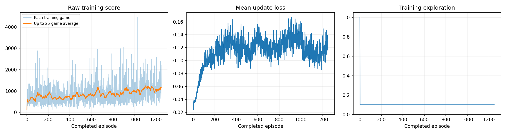
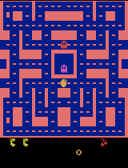
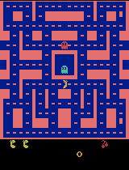

# Ms. Pac-Man DQN — Class 3

Training a Deep Q-Network to play Ms. Pac-Man with the supplied
[`pacman-dqn`](https://github.com/pepealonso95/pacman-dqn) notebook.

**Result: mean evaluation score rose from 492.0 to 1,004.0 (+512, +104%), with all five
evaluation seeds improving.**

I ran the experiment twice. The first run, at the budget I originally planned, produced a
statistically null result. The second run tripled the budget and produced real learning. Both are
reported here in full, because the comparison between them is the most informative thing in this
repository.

| | Run 1 | **Run 2 (leaderboard entry)** |
|---|---|---|
| Episodes | 400 | **1,250** |
| Baseline mean | 492.0 | 492.0 |
| Trained mean | 602.0 | **1,004.0** |
| Change | +110 (+22%) | **+512 (+104%)** |
| Seeds improved | 2 of 5 | **5 of 5** |
| Paired *t* (df=4) | 0.62 | **2.67** |
| Verdict | indistinguishable from noise | real improvement |

Run 2 is the leaderboard entry because it was the pre-planned larger-budget run — that decision
was made before its results existed, not chosen afterwards for being higher. See
[Why run 2 is the entry](#why-run-2-is-the-entry).

## Contents

| File | What it is |
|---|---|
| [`pacman_dqn.ipynb`](pacman_dqn.ipynb) | Run 2, executed, all outputs intact |
| [`notebooks/pacman_dqn_run1_400ep.ipynb`](notebooks/pacman_dqn_run1_400ep.ipynb) | Run 1, executed |
| [`results/run2_1250ep/comparison.json`](results/run2_1250ep/comparison.json) | **All ten evaluation scores for run 2** |
| [`results/run2_1250ep/config.json`](results/run2_1250ep/config.json) | Every setting and package version |
| [`results/run2_1250ep/training.csv`](results/run2_1250ep/training.csv) | Per-episode score, loss, decisions, timing |
| [`results/run2_1250ep/training_summary.json`](results/run2_1250ep/training_summary.json) | Run totals |
| [`results/run1_400ep/`](results/run1_400ep/) | The same seven files for run 1 |

## How to run it

1. Open [`pacman_dqn.ipynb`](pacman_dqn.ipynb) in Google Colab, or locally on a Python 3.11–3.13 kernel.
2. **Runtime → Change runtime type → T4 GPU.**
3. **Runtime → Run all.** The notebook installs its own packages and detects CUDA, MPS, or CPU.

The three settings live in the Section 1 cell. Nothing else needs editing to reproduce run 2.

## What the agent observes, does, and is rewarded for

**Observations — four game screens.** The agent never sees the game the way a person does. Each
frame is cropped and shrunk to an 84×84 grayscale image, and the four most recent frames are
stacked into one input. Four frames rather than one because a single still picture cannot show
motion: from one frame you cannot tell whether a ghost is closing in or moving away. The stack is
what makes direction and speed visible.

**Actions — joystick moves.** The agent picks one of nine Atari joystick positions, which the
notebook prints as `['NOOP', 'UP', 'RIGHT', 'LEFT', 'DOWN', 'UPRIGHT', 'UPLEFT', 'DOWNRIGHT',
'DOWNLEFT']`. It chooses once every four emulator frames, roughly fifteen decisions per second of
game time. There is no notion of "eat the pellet" or "run from the ghost" anywhere in the code —
only joystick positions.

**Reward — game points.** Every point Ms. Pac-Man scores is the reward signal. Nothing else is
supplied: no bonus for surviving, no penalty for dying, no hand-written advice about ghosts. The
agent has to infer that dying is bad purely from the points it stops collecting afterwards.

One wrinkle that matters, and it drives the limitation below: during learning the reward is
clipped to the range −1 to +1 by `float(np.clip(reward, -1, 1))`. Every score in this README is
real game points, but the learner only ever saw +1 or 0.

## The three settings

| Setting | Default | Mine |
|---|---|---|
| Exploration | 0.20 | **0.10** |
| Episodes | 100 | **1,250** (run 1 used 400) |
| Learning rate | 0.0001 | **0.0001** (kept) |

**Exploration = 0.10.** The default of 0.20 is too high for this environment, and the reason is in
the environment constructor: `repeat_action_probability=0.25`. Sticky actions are on, so the
emulator ignores the agent's chosen action and repeats the previous one a quarter of the time.
Stacking 20% epsilon-greedy noise on top means the agent's intended move survives only about 60%
of steps — not enough control to execute the kind of sustained route through a maze corridor that
scoring requires. Exploration here is also *constant*: the code reads
`epsilon = 1.0 if total_steps < WARMUP_STEPS else EXPLORATION`, with no decay, so whatever I pick
is a permanent noise floor rather than a starting point. I chose 0.10 because evaluation runs at
0.05, and keeping the training state distribution close to the evaluation distribution matters
more here than extra coverage. Coverage is still protected by the 1,000 fully-random warm-up
decisions, which the enlarged replay buffer retains for the whole run.

**Episodes = 1,250.** This is the setting that decided the experiment, and I got it wrong the
first time. See [Two runs](#two-runs-and-what-the-first-one-taught-me) — 400 episodes produced
59,985 gradient updates and no measurable learning; 1,250 produced 201,217 and clear learning.
Even 1,250 is tiny by Atari standards, where published DQN results use 50 million frames against
this run's 3.2 million.

**Learning rate = 0.0001, kept at the default.** A deliberate choice, not an omission. Adam at
1e-4 is the well-tested Atari value, and two properties of this notebook argue against raising it.
First, the network is plain DQN with no Double-DQN correction, so Q-value overestimation compounds
unchecked. Second, and decisively, evaluation reloads `trained.pt` — the **final** network, not the
best checkpoint. A late-training divergence is therefore unrecoverable and would cost the entire
result. Trading a modest speedup for that risk was not worth it, and holding the learning rate
fixed let run 1 and run 2 differ in exactly one setting.

## The one other change I made: replay capacity

The assignment permits tuning other hyperparameters with an explanation. I changed exactly one:

```python
REPLAY_CAPACITY = 50000   # was 5000
```

The default of 5,000 transitions is the notebook's most serious structural limitation. At roughly
35 KB per transition — the notebook computes this itself as `REPLAY_CAPACITY * 5 * 84 * 84` — the
buffer holds under two episodes of experience. Minibatches drawn from it are therefore almost
on-policy and heavily correlated with one another, which defeats the purpose of experience replay:
breaking that correlation is why DQN has a replay buffer at all. With a two-episode buffer the
network continually overwrites what it learned from earlier states, the textbook
catastrophic-forgetting setup.

At 50,000 the buffer holds roughly seventeen episodes. The notebook printed the cost as
`Replay pixel budget: 1682 MiB`, against Colab's ~12.7 GB.

**No evaluation setting was touched.** `EVAL_SEEDS` and `EVAL_EXPLORATION` are
`[101, 202, 303, 404, 505]` and `0.05` in both runs' `config.json`, identical before and after
training, as required.

I also added one optional cell that mounts Google Drive and changes the working directory, so
checkpoints written every 25 episodes would survive a Colab disconnect. It affects no
hyperparameter and no evaluation setting — only where files are written.

## What I expected, and what I observed

**The expectations below were committed to this repository before training started** (commit
`4be5958`) and are reproduced unedited. Two of the four were wrong.

| Prediction | Outcome |
|---|---|
| Baseline 150–350 | ❌ **Wrong. Baseline was 492.0.** |
| Trained 600–1,200 | ✅ Run 2 landed at 1,004.0 |
| Loss noisy, poorly correlated with score | ✅ Loss *rose* 0.045 → 0.119 while score doubled |
| Risk: final network below mid-run peak | ✅ Real risk, but did not materialize |

**Why the baseline prediction was wrong, and it is an instructive miss.** I argued that an
untrained CNN commits to a single action and would therefore score at or below a random policy.
The commitment part was right; the conclusion was not. Ms. Pac-Man's opening corridor is dense
with pellets, so an agent that simply holds one direction sweeps up several hundred points before
a ghost reaches it — and `noop_max=30` plus 25% sticky actions plus 5% evaluation epsilon keep it
from getting permanently stuck against a wall. A degenerate policy is not a bad policy in this
game's first ten seconds. I underestimated the baseline by roughly 40%, which also means the
improvement I was chasing was harder-won than I expected: run 2's 1,004.0 is a doubling of a
genuinely non-trivial 492.0, not of a near-zero floor.

The loss prediction is worth dwelling on. Loss **increased** by a factor of 2.6 across run 2 while
the score doubled. That is normal — as the agent survives longer and collects more reward, the
Q-values it is regressing toward grow, so the absolute smooth-L1 error grows with them. Anyone
reading falling loss as evidence of better play, or rising loss as evidence of worse play, would
have drawn the wrong conclusion from this run in both directions.

## Two runs, and what the first one taught me

**Run 1 (400 episodes) produced no measurable learning.** Mean rose 492.0 → 602.0, which looks
like a 22% gain until it is broken out by seed:

| Seed | Before | After | Δ |
|---|---|---|---|
| 101 | 350 | 420 | +70 |
| 202 | 500 | 400 | −100 |
| 303 | 320 | 1120 | **+800** |
| 404 | 800 | 610 | −190 |
| 505 | 490 | 460 | −30 |

Three of five seeds got *worse*. The median change is −30. The entire mean gain comes from one
game on seed 303. Paired *t* = 0.62 against the 2.78 needed at n=5, and the training-score trend
was +0.283 points/episode at *t* = 1.39 — also not significant. With an episode-score standard
deviation of 470, a five-game mean carries roughly ±210 points of noise, and a 110-point gap
disappears inside it.

**The diagnosis was budget, and it was testable.** Run 1 ran 240,938 decisions and 59,985 gradient
updates in 18.1 minutes — six times faster than I had planned for, because I had assumed episodes
would approach the 3,000-decision cap. They did not: the agent loses all three lives in about 600
decisions, roughly 40 seconds of game time, and **no episode in either run ever hit the cap.** That
left most of the intended session unused.

**Run 2 changed exactly one setting**, `EPISODES` 400 → 1,250, and confirmed the diagnosis:

| | Run 1 | Run 2 |
|---|---|---|
| Decisions | 240,938 | 805,867 |
| Learning updates | 59,985 | **201,217** |
| Training trend | +0.283 pts/ep (*t* = 1.39) | **+0.378 pts/ep (*t* = 10.96)** |
| Mean episode length | 598 → 617 decisions | **598 → 706 decisions** |

Run 2's training-score block means climb almost monotonically across the run:

| Episodes | 1–125 | 126–250 | 251–375 | 376–500 | 501–625 | 626–750 | 751–875 | 876–1000 | 1001–1125 | 1126–1250 |
|---|---|---|---|---|---|---|---|---|---|---|
| Mean score | 702 | 746 | 669 | 774 | 804 | 878 | 860 | 986 | 1070 | **1098** |

The agent also survives 18% longer by the end, so the gain is partly living longer and partly
scoring faster while alive.

### Why run 2 is the entry

Choosing the better of two runs is a selection effect, and reporting a number chosen that way
without saying so would inflate it. Two things make this case different, and both are checkable
from the files here:

1. **The choice was made before the outcome existed.** Run 2 was planned as the larger-budget run
   after run 1's null result was diagnosed. It is not the higher of two equivalent draws.
2. **The evidence does not depend on the five reported seeds.** The training-trend test uses 1,250
   independent games and returns *t* = 10.96. That is a far stronger signal than the evaluation
   itself provides, and it cannot be an artifact of a lucky evaluation seed.

**What I did not do:** the runs saved 66 intermediate checkpoints between them. I did not evaluate
those and publish the best one. Selecting a checkpoint using the same five seeds the leaderboard
reports would be tuning on the reported test set, and the resulting number would be meaningless.
Every score here comes from the final `trained.pt` of a run, evaluated once.

## Run facts

| | Run 1 | Run 2 (published) |
|---|---|---|
| Status | completed | completed |
| Episodes completed | 400 / 400 | **1,250 / 1,250** |
| Total decisions | 240,938 | **805,867** |
| Learning updates | 59,985 | **201,217** |
| Elapsed | 1,088.97 s (18.1 min) | **3,500.33 s (58.3 min)** |
| Episodes hitting the 3,000-decision cap | 0 | 0 |
| Hardware | Colab T4 GPU, CUDA | Colab T4 GPU, CUDA |
| Software | Python 3.13.15, torch 2.11.0+cu128, gymnasium 1.3.0, ale-py 0.11.2 | same |

Neither run was interrupted and both performed real learning updates.

## Evaluation: all five scores, before and after

Same five seeds, 5% exploration, same 3,000-decision cap, before and after training. The baseline
is an untrained network, not a random-action agent. Full data:
[`run2_1250ep/comparison.json`](results/run2_1250ep/comparison.json) ·
[`run1_400ep/comparison.json`](results/run1_400ep/comparison.json)

| Game | Seed | Before (untrained) | After — run 2 | Δ | After — run 1 |
|---|---|---|---|---|---|
| 1 | 101 | 350 | 540 | +190 | 420 |
| 2 | 202 | 500 | 1370 | +870 | 400 |
| 3 | 303 | 320 | 1380 | +1060 | 1120 |
| 4 | 404 | 800 | 890 | +90 | 610 |
| 5 | 505 | 490 | 840 | +350 | 460 |
| | **Mean** | **492.0** | **1004.0** | **+512.0** | 602.0 |

All five seeds improved in run 2. Paired *t* = 2.67 (df=4), which sits just under the 2.78 needed
for two-tailed significance at n=5 and clears the one-tailed threshold of 2.13; the sign test on
5-of-5 gives one-tailed *p* = 0.031. With only five games the evaluation is inherently a coarse
instrument — the training-trend test above is the stronger evidence, and the two agree.

No game in either condition was time-limited, so nothing was cut off by the step cap.

## Training curves



Score, loss, and exploration across all 1,250 episodes of run 2. Exploration is flat at 0.10 after
the 1,000-step warm-up, by design — this notebook has no epsilon decay. Run 1's dashboard is at
[`results/run1_400ep/training_dashboard.png`](results/run1_400ep/training_dashboard.png).

## Gameplay

Untrained versus the best of the five trained evaluation games, both from run 2, both showing at
most the first 20 seconds at 4× speed.

| Untrained network | Best trained game |
|---|---|
|  |  |

Intermediate gameplay across training — the run produced 50 of these, one every 25 episodes; a
representative sample is shown and the complete set is in
[`results/run2_1250ep/gifs/`](results/run2_1250ep/gifs/).

| Episode 250 | Episode 500 | Episode 750 | Episode 1000 | Episode 1250 |
|---|---|---|---|---|
|  |  |  |  |  |

## One limitation

**Reward clipping makes the agent blind to what is actually worth points.** During training every
reward passes through `float(np.clip(reward, -1, 1))`. A 10-point pellet becomes +1. A ghost eaten
after a power pellet is worth 200, then 400, 800, and 1,600 points — and also becomes +1. Four
ghosts eaten in a single power-pellet window are worth 3,000 points, more than an entire round of
diligent pellet-eating, and the learner cannot distinguish that from swallowing one dot.

The consequence is structural rather than incidental: the agent has no gradient whatsoever
pointing toward the power-pellet-then-hunt strategy that separates high Ms. Pac-Man scores from
mediocre ones. It can only learn "move toward things that give reward, and avoid dying."

The measurements are consistent with exactly that. Across run 2 the agent's mean episode length
grew 18% (598 → 706 decisions) while its mean score grew 56% — it learned to survive longer and to
sweep pellets more efficiently. It never learned a different *kind* of play, and no episode in
either run reached the 3,000-decision cap, meaning the agent never survived long enough for
board-clearing strategy to matter. Clipping exists for a good reason — it stabilizes gradients
across games with wildly different point scales — but on Ms. Pac-Man specifically it discards the
game's central strategic decision.

## The next experiment I would run

**Change one setting: replace reward clipping with reward scaling.** Instead of
`np.clip(reward, -1, 1)`, divide the raw reward by a constant — dividing by 100 maps a pellet to
0.1 and a fourth ghost to 16.0. That preserves the gradient stability clipping was introduced for,
while restoring the *relative* value of ghost-eating that clipping destroys.

I would change this one thing and hold everything else fixed. The prediction that makes it
falsifiable: mean evaluation score rises, and the trained GIFs show the agent moving toward power
pellets rather than treating them as ordinary food. The risk worth naming is that larger reward
magnitudes destabilize the Q-targets — exactly the failure clipping was introduced to prevent — so
the run could come out worse, and that result would be worth reporting too.

I am choosing this over simply buying more episodes, even though **run 2's learning curve had not
plateaued** — its final two blocks were its highest and the fit was still linear, so more budget
would still pay. But more budget buys more of the same behaviour. Reward scaling changes what the
agent is *able* to learn, and this experiment's own history is the argument: run 1 → run 2 already
demonstrated what the budget axis is worth, and the ceiling that remains is the one clipping
imposes.

## Where the checkpoints are

Model checkpoints (`.pt`) are not in this repository — 66 of them across the two runs, at 6.8 MB
each. They are kept in the full run ZIPs saved locally (`run1_400ep_20260910_013642.zip`, 108 MB,
and `run2_1250ep_20260910_020749.zip`), which also contain every file reproduced here. The
evidence in `results/` is copied from those archives unmodified.
